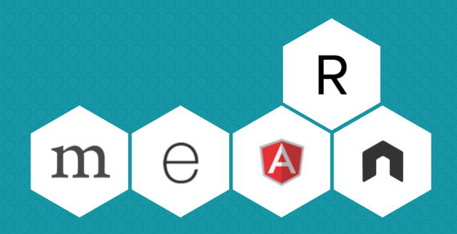

# online_file_sharing_mysql
A web application imitating features of dropbox with React.js, Express, Node.js and MySQL.
> Individual academic project for Graduate software engineering course 273 - Enterprise Distributed Systems.

## Goal

* The goal is to build a distributed enterprise web application which enables the user not only to upload , star/unstar or delete files/folders but also share files/folders to other users, create groups, add/edit/delete members and view their own activity timeline.

* We were tasked with this project requirement so that so that we can learn and develop distributed RESTful services

## System Design
> Applications uses a simple Client-Server architecture where there are as many as 1 React components, 8 API’s  to support different functionalities.

### Technology stack

<table>
<thead>
<tr>
<th>Area</th>
<th>Technology</th>
</tr>
</thead>
<tbody>
	<tr>
		<td>Front-End</td>
		<td>React, Redux, React Router, Bootstrap, HTML5, CSS3, Javascript ( ES6 )</td>
	</tr>
	<tr>
		<td>Back-End</td>
		<td>Express, Node.js</td>
	</tr>
	<tr>
		<td>API Testing</td>
		<td>Mocha, Postman</td>
	</tr>
	<tr>
		<td>Database</td>
		<td>MySQL</td>
	</tr>
	<tr>
		<td>Performance Testing</td>
		<td>JMeter</td>
	</tr>
</tbody>
</table>
 
